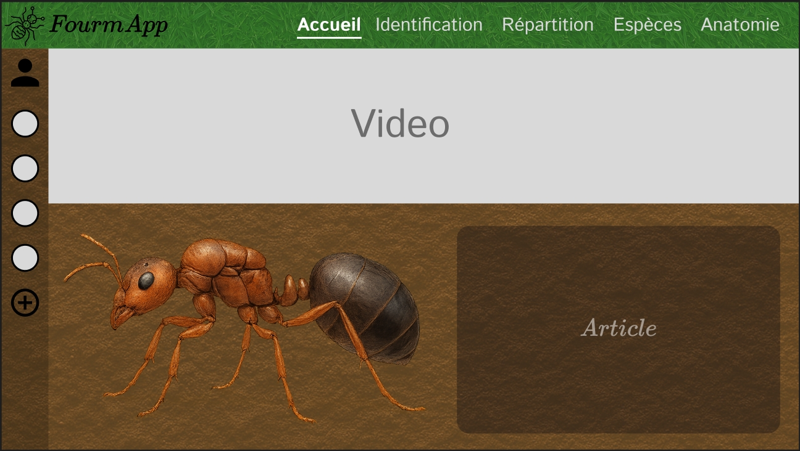
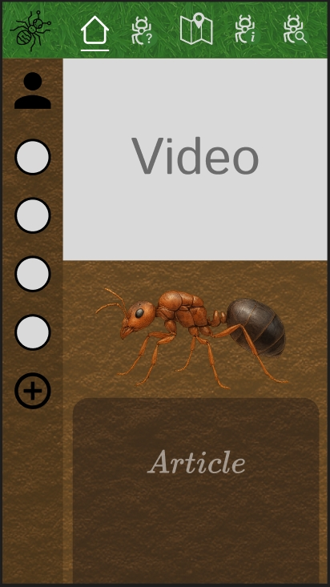
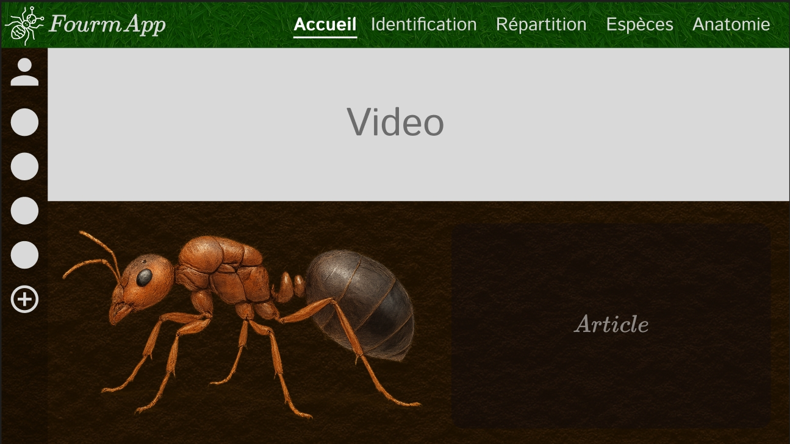
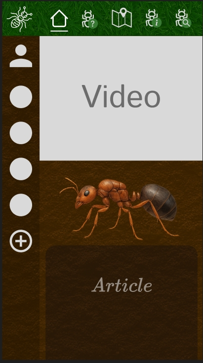

# FourmApp Front : Julie KREUWEN
## Préparation du projet :

Visuel attendu pour la page d'accueil :

Thème light version pc et mobile

Thème dark version pc et mobile

Lien du Figma pour l'ensemble des maquettes :
https://www.figma.com/design/adoUELLn9l7vEmZiGI3dZh/FourmApp?node-id=0-1&p=f&t=mI8OzxlzgQ1D3n0a-0

## Liste des fonctionnalités :
- Authentification utilisateur :

    - Connexion avec token JWT

    - Sécurisation des routes API

- Interface utilisateur latérale (LeftBar)

    - Boutons de navigation : profil, paramètres, colonies

    - Icônes dynamiques via React Icons

- Gestion des colonies de fourmis

    - Liste dynamique des colonies récupérées via API

    - Ajout d’une colonie vide via un bouton (+)

    - Édition des informations d'une colonie :

        - Nom de la colonie

        - Espèce

        - Nombre d’individus

        - Dernier nourrissage

        - Dernière humidification

    - Sauvegarde des modifications via PUT

- Suppression d’une colonie

    - Bouton de suppression dans l’overlay

    - Confirmation et appel API DELETE

- Overlay dynamique pour chaque colonie

    - Chargement automatique des données de la colonie sélectionnée

    - Support du passage d’une colonie à une autre (reset de l’état)

- Multilingue (i18n)

    - Traduction en français et anglais

    - Interface traduite dynamiquement (via react-i18next)

- Formatage des dates localisé

    - Affichage des dates adapté à la langue active (toLocaleDateString)

- Composants séparés et modulaires

    - SettingsOverlay, ProfilOverlay, AntColonyTrackingOverlay, etc.

## Liste des bonus :
- Présence d'une maquette Figma pour guider le développement de l'interface
- Fond d’écran animé (vidéo non interactive)
- Changement automatique du format de date selon la langue (FR / EN)